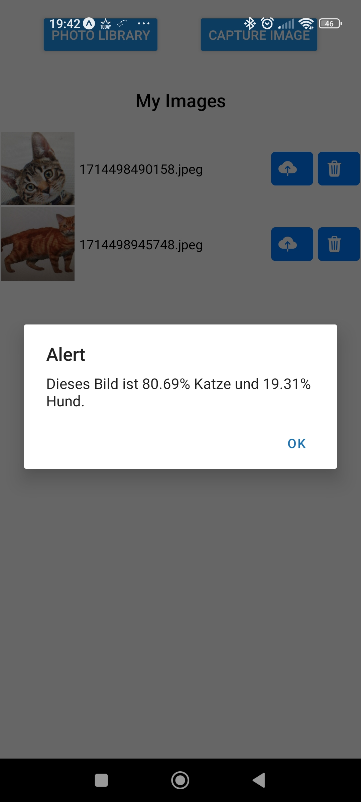
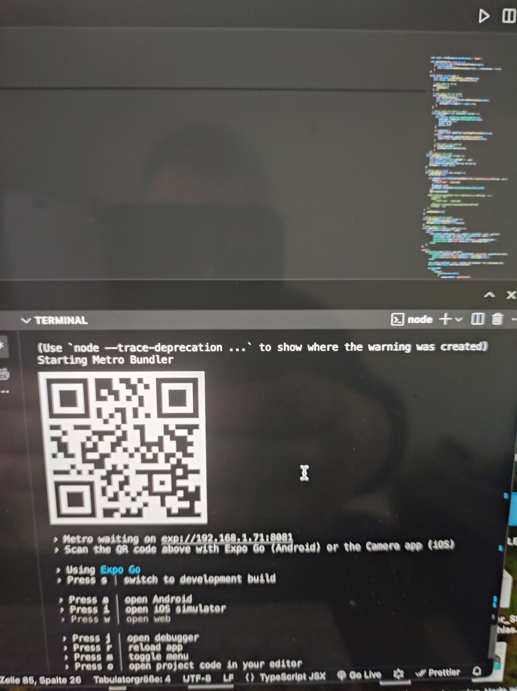

- Tutorial: https://galaxies.dev/react-native-image-upload
- have nodejs installed
- install expo cli on your machine: `npm install --global expo-cli`
- old version: `expo init .`
```
npx create-expo-app frontend -t expo-template-blank-typescript
cd frontend
npx expo install expo-image-picker
npx expo install expo-file-system
```
- to start app `yarn start` then scan qr code with expo app (previously installed from app / play store)



