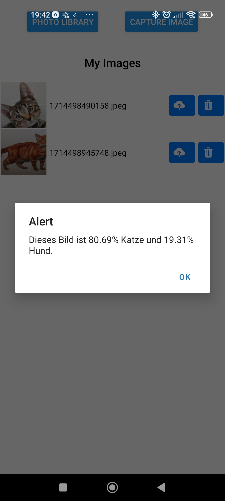
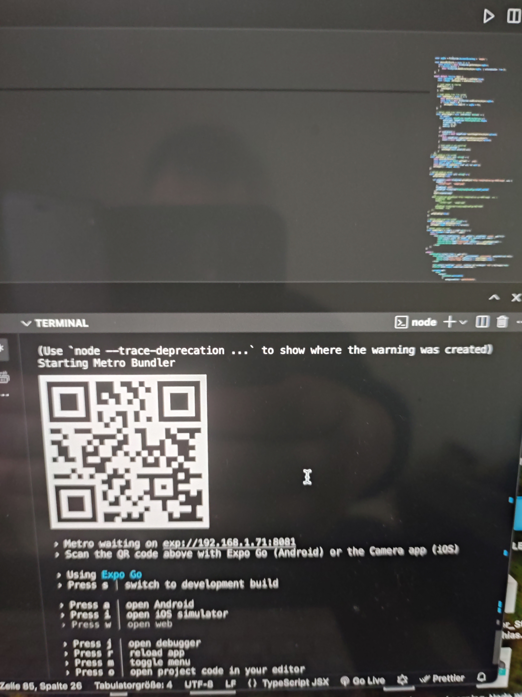

# Intro and Prerequisites

- Tutorial with source code: [React Native Image Upload Tutorial](https://galaxies.dev/react-native-image-upload)
- Have Node.js installed: [Download Node.js](https://nodejs.org/en/#download)
- Install Expo CLI on your machine: `npm install --global expo-cli`

# Initialize a New Project (Optional)

To migrate to a new Expo version, initialize a new empty project and replace the generated files with the content of `App.tsx` and `app.json` from this repository. Also, add the compiler options in `package.json`.

```sh
npx create-expo-app frontend -t expo-template-blank-typescript
cd frontend
npx expo install expo-image-picker
npx expo install expo-file-system
```

# Installation

Install the necessary dependencies using npm or yarn:

```sh
npm install
# or
yarn
```

# Run the Application

Start the application using npm or yarn:

```sh
npm start
# or
yarn start
```

Then, scan the QR code with the Expo Go App (previously installed from the App Store or Play Store).

# Screenshots




# Demo

Try the demo on Snack: [React Native Frontend Demo](https://snack.expo.dev/@petethegreat/react-native-frontend). Make sure you have the Expo Go App installed, as it is the standard for React Native app development and staging.

## Storage Adapter (ohne expo-file-system)

Der Adapter (`src/filesystemAdapter.ts`) nutzt jetzt nur noch:

- Web: `localStorage` (Data-URLs / URIs) unter dem Key `images`
- Native: `AsyncStorage` (`@react-native-async-storage/async-storage`)

Es werden keine Dateien mehr ins echte Dateisystem kopiert; wir speichern ausschließlich Referenz-URIs oder Data-URLs. Das vereinfacht die Plattformgleichheit, hat aber Grenzen bei großen Dateien (Speicherverbrauch, Serialisierung).

Exponierte Funktionen bleiben identisch:

```ts
FSAdapter.listImages()
FSAdapter.saveImage(uri)
FSAdapter.removeImage(uri)
FSAdapter.uploadImage(uri, endpoint)
```

Für spätere Erweiterungen (z.B. echtes Caching, größere Binärdaten) könntest du:

- Native: wieder `expo-file-system` oder `expo-media-library` einführen
- Web: auf IndexedDB (z.B. via `idb`) umstellen

Der Code in `App.tsx` muss dafür nicht angepasst werden – nur der Adapter.

## Expo Upgrade Helper

Ein Skript (`scripts/upgrade-expo.js`) prüft Kernversionen (expo, react, react-native, react-native-web, typescript, @types/react) gegen Zielversionen.

Verwendung:

```sh
yarn upgrade:check   # zeigt Unterschiede
yarn upgrade:write   # schreibt Zielversionen in package.json (führt KEIN yarn install aus)
```

Danach:

```sh
rm -rf node_modules yarn.lock
yarn install
yarn start --clear
```

## Häufige Cache-Probleme (Metro / expo-file-system)

Wenn weiterhin ein Fehler wie `Unable to resolve module 'module://expo-file-system.js'` auftaucht:

```sh
watchman watch-del-all 2>/dev/null || true
rm -rf "$TMPDIR"/metro-* "$TMPDIR"/haste-map-*
rm -rf .expo/.web-cache .expo/web .cache dist
expo start -c
```

Zusätzlich Browser Hard Reload (Cmd+Shift+R) und in Expo Go die App komplett schließen und neu öffnen.

## Node-Version

Empfohlen ist eine LTS-Version (z.B. Node 20). Sehr neue Versionen (Node 23+) können beim direkten `require` von TypeScript-Quellen unter node_modules Warnungen oder Fehler werfen, die für den Metro-Build allerdings irrelevant sind.

